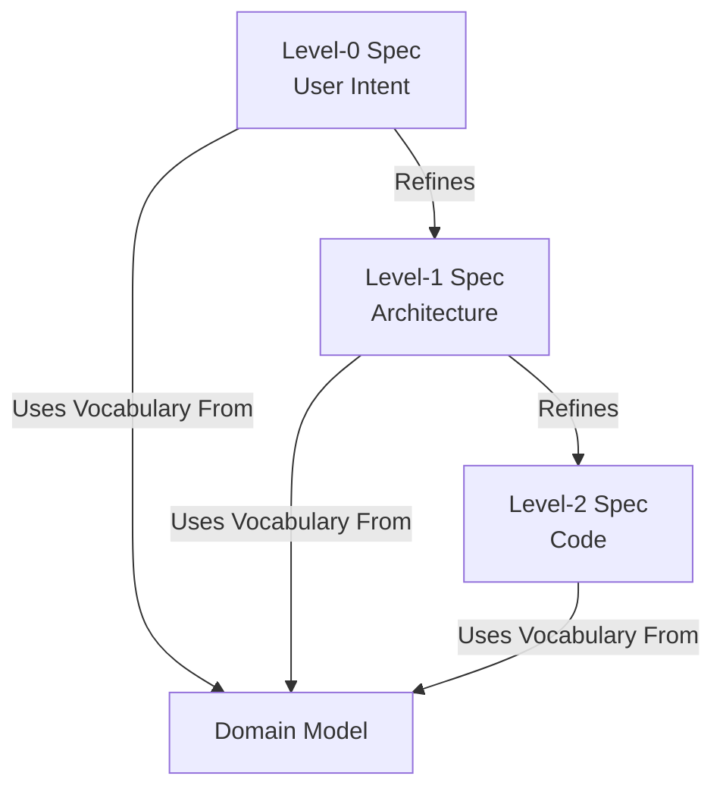

# Features

In the DSpec framework, a **Feature** is the primary unit of specification and delivery. It represents a distinct slice of functionality that provides value to a user or system.

A Feature is not a single document; it is a vertical slice of functionality underpinned by a **Domain Model** and defined progressively through **three levels of specification**.

To manifest a feature deterministically and unambiguously, it must be fully specified across all three levels.

## The Structure of a Feature

A complete DSpec Feature is composed of:

1.  **The Domain Model (Foundation):** Defines the vocabulary, invariants, and rules.
2.  **Level-0 Spec (Intent):** Defines *what* the feature does (User Intent & Outcomes).
3.  **Level-1 Spec (Design):** Defines *how* the system is architected to handle it (Commands & Consistency).
4.  **Level-2 Spec (Implementation):** Defines *how* it is coded (Tables, Classes, Functions).

### Visualizing the Stack

## The Relationship: Features and Domain Models

A common pitfall in software specification is mixing definitions with behavior. DSpec strictly separates these:

1.  **The Domain Model** is the foundation. It defines the **Ubiquitous Language**: the entities, value objects, and invariant rules that are true regardless of any specific user workflow.
    *   *Example:* "A `BankAccount` must have a non-negative balance."

2.  **The Feature** is the application of that model. It orchestrates the domain elements to achieve a specific outcome.
    *   *Example:* "User transfers money." This feature relies on the concept of `BankAccount` defined in the Domain Model but focuses on the *flow* of the transfer.

### "Features sit on top of the Domain Model"

You cannot write a concise, readable Feature spec without a Domain Model. The Domain Model acts as the dictionary. If your Feature spec is cluttered with definitions of data structures or validation rules, it’s a sign that those belong in the Domain Model.

## The Three Levels of a Feature

While a Feature starts at Level-0, it is not complete until it has been constrained through all layers.

### 1. Level-0: The Feature Spec (Intent)
Focuses entirely on the **User Intent** and the **System Consequence** (Events).
*   **Intent:** What is the user trying to do? (e.g., `PlaceOrder`)
*   **Preconditions:** What must be true for this to happen? (e.g., `UserIsLoggedIn`)
*   **Outcome:** What facts are recorded in the system history? (e.g., `OrderPlaced`)

### 2. Level-1: The Design Spec (Architecture)
Focuses on the **Mechanisms** and **Consistency**.
*   **Commands:** How does the user trigger the intent? (e.g., `POST /orders`)
*   **Consistency:** Is this strongly consistent (ACID) or eventually consistent?
*   **Components:** Which system components handle the logic?

### 3. Level-2: The Implementation Spec (Code)
Focuses on the **Technology** and **Storage**.
*   **Schema:** Exact SQL tables or JSON structures.
*   **Classes:** Specific class names and method signatures.
*   **Code:** The actual implementation details.

By strictly layering these concerns, the DSpec framework ensures that business intent (L0) remains stable even if the implementation (L2) changes.