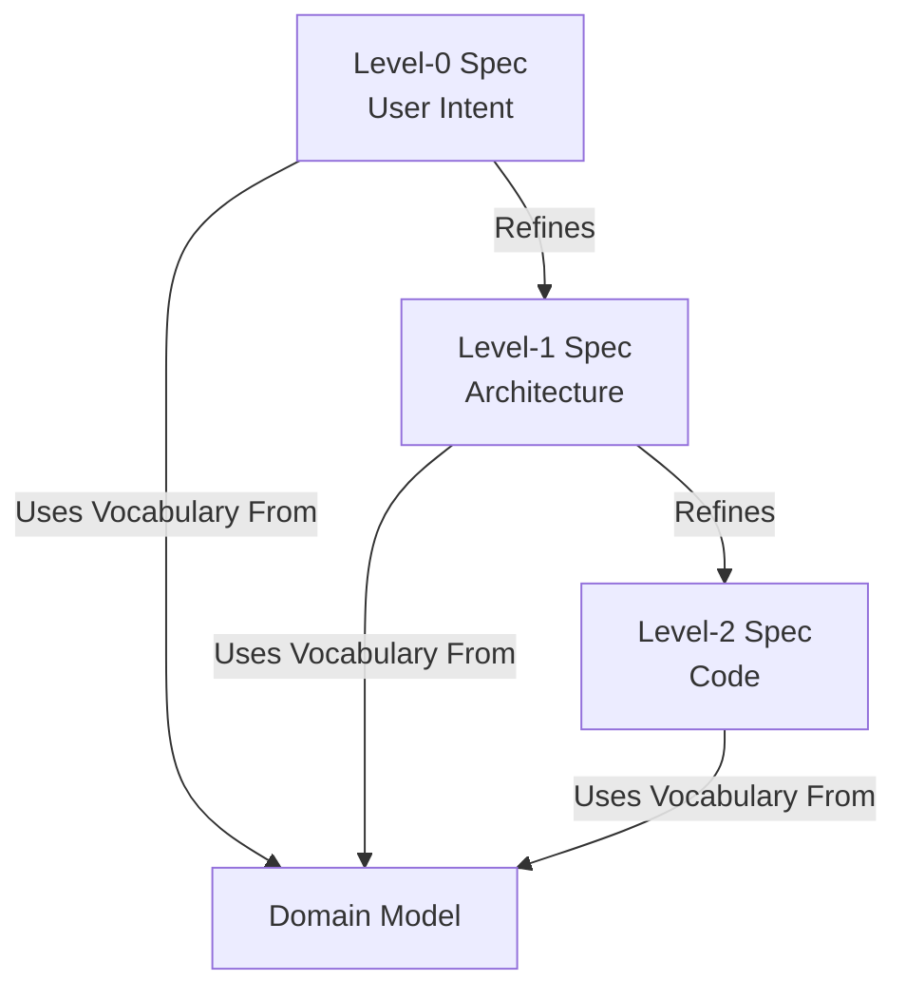

# Features

In the DSpec framework, a **Feature** is the primary unit of specification and delivery. It represents a distinct slice of functionality that provides value to a user or system.

A Feature is not a single document; it is a vertical slice of functionality underpinned by a **Domain Model** and defined progressively through **three levels of specification**.

To manifest a feature deterministically and unambiguously, it must be fully specified across all three levels.

## The Structure of a Feature

A complete DSpec Feature is composed of:

1.  **The Domain Model (Foundation):** Defines the vocabulary, invariants, and rules.
2.  **Level-0 Spec (Intent):** Defines *what* the feature does (User Intent & Outcomes).
3.  **Level-1 Spec (Design):** Defines *how* the system is architected to handle it (Commands & Consistency).
4.  **Level-2 Spec (Implementation):** Defines *how* it is coded (Tables, Classes, Functions).

### Visualizing the Stack



## The Relationship: Features and Domain Models

A common pitfall in software specification is mixing definitions with behavior. DSpec strictly separates these:

1.  **The Domain Model** is the foundation. It defines the **Ubiquitous Language**: the domain concepts, definitions, and invariant rules that are true regardless of any specific user workflow.
    *   *Example:* "A `BankAccount` must have a non-negative balance."

2.  **The Feature** is the application of that model. It orchestrates the domain elements to achieve a specific outcome.
    *   *Example:* "User transfers money." This feature relies on the concept of `BankAccount` defined in the Domain Model but focuses on the *flow* of the transfer.

### "Features sit on top of the Domain Model"

You cannot write a concise, readable Feature spec without a Domain Model. The Domain Model acts as the dictionary. If your Feature spec is cluttered with definitions of data structures or validation rules, it’s a sign that those belong in the Domain Model.

## Atomic Features and Decomposition

A core principle of DSpec is that Features are **atomic**. This means a Feature should represent the smallest unit of functionality that provides distinct value to a user or system and can be independently delivered, verified, and reasoned about.

The ideal Feature is small and focused. If a Feature grows too large or encompasses disparate concerns, it can be a "smell" indicating that it needs to be broken down. DSpec provides two primary mechanisms for this decomposition:

### 1. Grouping Complex Requirements (within a single Feature)

Even an atomic Feature can involve a complex set of requirements or steps. To maintain readability and organization within a single Level-0 spec, you can use **grouping** for `scope` items. This allows you to logically categorize related requirements without breaking the Feature into separate entities.

*   **When to use:** When distinct parts of the user intent are tightly coupled and do not provide standalone value outside the current Feature. The Feature as a whole remains the single unit of delivery.
*   **Example:** A `feature.order-checkout` might group its scope items into "Payment Processing Steps" and "Order Fulfillment Steps."

```yaml
# In feature.order-checkout (Level-0)
scope:
  in:
    - id: group.payment
      name: "Payment Processing"
      description: "Steps involved in handling customer payment."
      items:
        - id: scope.payment.authorize
          statement: "Authorize customer's credit card."
        - id: scope.payment.capture
          statement: "Capture funds for the order."
    - id: group.fulfillment
      name: "Order Fulfillment"
      description: "Steps to prepare and ship the order."
      items:
        - id: scope.fulfillment.allocate-inventory
          statement: "Allocate inventory for ordered items."
        - id: scope.fulfillment.create-shipment
          statement: "Create shipment request."
```

### 2. Reuse and Dependencies (across multiple Features)

If a distinct piece of functionality provides value on its own and can be utilized by multiple other Features, it should be defined as its own separate Feature. This allows for reuse and clear dependency tracking.

*   **When to use:** When a component or capability has its own lifecycle, business rules (Invariants), and can function independently. It's a "child" feature that other "parent" features consume.
*   **Example:** Both `feature.order-checkout` and `feature.subscription-renewal` might need to process payments. Instead of duplicating payment logic in each, `feature.payment-processing` can be a reusable Feature.

```yaml
# In feature.order-checkout (Level-0)
dependencies:
  upstream:
    - 'feature.payment-processing'

# In feature.subscription-renewal (Level-0)
dependencies:
  upstream:
    - 'feature.payment-processing'
```

### Benefits of this Approach (vs. Formal "Subfeatures")

By using grouping for internal organization and dependencies for reuse, DSpec avoids the need for a formal "Subfeature" entity. This provides several key benefits:

*   **Clarity and Simplicity:** The Feature remains the single, atomic unit of value, preventing ambiguous states or partial deliveries.
*   **Reduced Complexity:** Avoids the "Russian Doll" problem of nested features, where defining boundaries, ownership, and verification becomes increasingly difficult.
*   **Strong Traceability:** `dependencies` explicitly map relationships between independent Features, while grouping clarifies the internal structure of a single Feature.
*   **Independent Deliverability:** Each Feature can theoretically be built and deployed on its own, fostering modularity.

This strategy ensures that the framework remains lightweight and focused on clear, declarative specifications, supporting both human understanding and AI agent consumption.

## Composition Patterns: Containers & Capabilities

A powerful pattern for structuring complex systems in DSpec is to distinguish between **Capability Features** (which own logic) and **Container Features** (which orchestrate or display capabilities).

This pattern resolves common dilemmas in both Frontend and Backend architecture.

### Frontend Example: The Dashboard (Composite UI)

A Dashboard is often one large "page" visually, but structurally it is a composition of distinct functionalities. Instead of defining all logic inside `feature.dashboard`, treat the Dashboard as a **Container** that aggregates other **Capability** features.

*   **feature.view-transactions** (Capability): Owns the logic for listing, filtering, and sorting transactions.
*   **feature.transfer-money** (Capability): Owns the form validation, API calls, and rules for moving funds.
*   **feature.dashboard** (Container): Owns the layout and orchestration.

```yaml
# feature.dashboard (Level-0)
meta:
  id: feature.dashboard
  name: User Dashboard
  # ...

intent: "Provide a high-level overview of financial health and quick access to common actions."

dependencies:
  upstream:
    - feature.view-transactions  # Reusing the transaction list capability
    - feature.transfer-money     # Reusing the transfer form capability

scope:
  in:
    - id: scope.layout
      statement: "Aggregate summary views from upstream features into a single responsive grid."
    - id: scope.interactions
      statement: "Clicking 'See All' on Transactions widget navigates to full Transaction history."
```

### Backend Example: Bulk Sync (Orchestration)

Similarly, a backend process like "Sync ERP to Shopify" can be decomposed. If you implement it as one giant script, it becomes hard to maintain. Instead, break it down:

*   **feature.sync-product** (Capability): Owns the logic to map *one* ERP product to Shopify, handle API rate limits, and validate data.
*   **feature.erp-bulk-sync** (Container): Owns the logic to iterate through the ERP catalog, manage job state, and call the single-product sync.

```yaml
# feature.erp-bulk-sync (Level-0)
meta:
  id: feature.erp-bulk-sync
  name: Bulk ERP Product Synchronization
  # ...

intent: "Ensure the entire Shopify catalog matches the ERP system state on a nightly basis."

dependencies:
  upstream:
    - feature.sync-product  # Reusing the logic to sync a single item

scope:
  in:
    - id: scope.iteration
      statement: "Iterate through all modified ERP products."
    - id: scope.orchestration
      statement: "Invoke feature.sync-product for each item, aggregating success/failure results."
```

By using **Composition**, you ensure that complex logic (like validation or mapping) is defined in exactly one place (the Capability Feature) and reused wherever it is needed (Dashboards, Bulk Jobs, Webhooks, etc.).

## The Three Levels of a Feature

While a Feature starts at Level-0, it is not complete until it has been constrained through all layers.

### 1. Level-0: The Feature Spec (Intent)
Focuses entirely on the **User Intent** and the **System Consequence** (Events).
*   **Intent:** What is the user trying to do? (e.g., `PlaceOrder`)
*   **Preconditions:** What must be true for this to happen? (e.g., `UserIsLoggedIn`)
*   **Outcome:** What facts are recorded in the system history? (e.g., `OrderPlaced`)

### 2. Level-1: The Design Spec (Architecture)
Focuses on the **Mechanisms** and **Consistency**.
*   **Commands:** How does the user trigger the intent? (e.g., `POST /orders`)
*   **Consistency:** Is this strongly consistent (ACID) or eventually consistent?
*   **Components:** Which system components handle the logic?

### 3. Level-2: The Implementation Spec (Code)
Focuses on the **Technology** and **Storage**.
*   **Schema:** Exact SQL tables or JSON structures.
*   **Classes:** Specific class names and method signatures.
*   **Code:** The actual implementation details.

By strictly layering these concerns, the DSpec framework ensures that business intent (L0) remains stable even if the implementation (L2) changes.